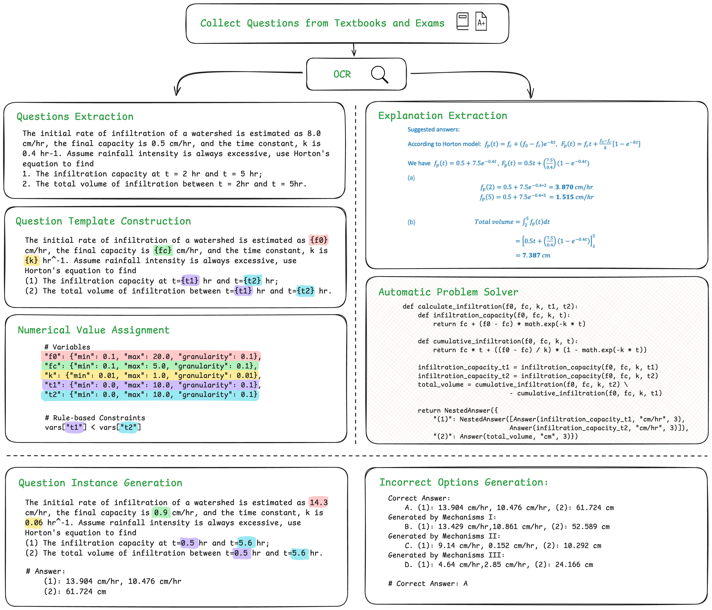

# ATMOSSCI-BENCH
Click here to view English version: [EN Version](./README.md)

Click here to view the Paper: [AstomsSciBench_Arxiv](https://arxiv.org/abs/2502.01159)

## 1. 介绍
### AtmosSci-Bench：填补评估空白
研究团队开发了AtmosSci-Bench，这是一个专门为大气科学设计的评估基准。该基准涵盖了五大核心领域： 
+ Hydrology 水文学：涉及降水、径流和水资源管理等关键问题
+ Atmospheric Dynamics 大气动力学：研究大气运动及其对天气和气候的影响
+ Atmospheric Physics 大气物理学：探索云、辐射和能量交换等物理过程
+ Geophysics 地球物理学：分析地球内部和表面的物理特性
+ Physical Oceanography 物理海洋学： 研究海洋的物理特性及其与气候系统的相互作用

在现有的模型评估体系中，传统的评测框架多侧重于通用任务，而未能有效涵盖大气科学领域中复杂的跨学科问题。AtmosSci-Bench 通过集成多学科知识的评测，填补了这一空白，为大气科学领域的人工智能应用提供了标准化的评估基准。

|  |
|:--:|
| *图1. 基于模板的问题生成框架的构造流程。左中角的块表示问题生成过程，其中变量用不同的颜色突出显示。右中间的块描述了自动问题解决器，它从给定的变量中得到答案。底部的方块说明了一个生成的问题及其相应的选项的示例。 *|

## 2. 评估结果与洞见

根据 AtmosSci-Bench 的评测结果，研究团队对四类大语言模型进行了全面的比较：指令调优模型、高级推理模型、数学增强模型、领域气候模型。结果显示，各类模型在处理大气科学问题时表现出显著差异。

|  |
|:--:|
| *表 1. 水文学 (Hydro)、大气动力学 (AtmDyn)、大气物理学 (AtmosPhy)、地球物理学 (GeoPhy) 和物理海洋学 (PhyOcean) 四个领域的四个 LLMs 类别在准确率（%）和符号标准偏差方面的性能比较。 *|

指令调优模型在基础任务（如简单的气象学问题）中表现稳定，准确率在 58.36% 到 64.93% 之间。然而，随着任务复杂度的增加，尤其是在需要复杂推理的任务中，准确率显著下降。特别是在处理多步骤推理和跨学科结合的任务时，这些模型的表现相对薄弱。

值得一提的是, DeepSeek - R1 在 Reasoning Model中取得了 89.4% 的综合得分，超越GPT-o1、Gemini-2.0-Flash-Thinking-Exp 等国际主流模型。这一结果表明 DeepSeek - R1 在处理需要推理能力的任务时，比其他模型具有显著优势。具体来说，DeepSeek - R1 在涉及多步骤推理、复杂数学计算和跨学科知识融合等任务中的表现明显超越其他模型。

## 3. How to Use
Click here to view English version: [EN Version](./README.md#3-how-to-use)